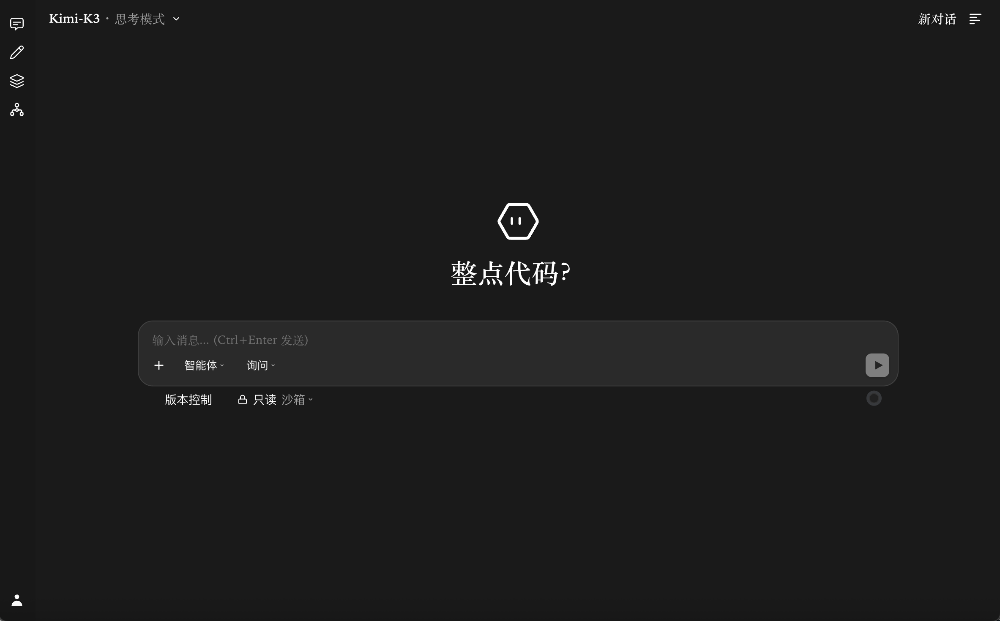

# Astrion

**自托管的全能型 AI 智能体系统**——把文件、终端、搜索、多模态、子智能体与 MCP 工具统一到一个可审计、可管控的 Agent 循环里。

> 命名：`Astr-`（星）+ `-ion`（粒子）。Agent 像星际间传递信号的粒子，把人类意图传递到工具、文件、终端与子智能体之间。



---

## ⚠️ 重要声明

- **本项目处于开发中，不要用于正式生产环境。**
- 诸多设计在 **macOS** 环境下开发与验证；Windows 下沙箱执行等许多功能**无法使用或未经检验**，Linux 部分支持（`bwrap + seccomp`）。
- 本项目的大量设计借鉴了 **Codex、Claude Code、OpenCode、OpenClaw** 等智能体产品的优秀实践，特此致谢。

## 核心特性

- **完整的 Agent 循环**：流式输出 + 工具调用编排，内置文件操作、持久终端、网络检索、图片/视频理解、待办与记忆等工具
- **双运行模式**：`web` 模式（线上多人 AI 服务，Docker 容器隔离）与 `host` 模式（本地个人智能体，宿主机 OS 沙箱）
- **双层安全模型**：权限模式（`readonly` / `approval` / `auto_approval` / `unrestricted`）× 执行环境（沙箱 / 直接执行）
- **子智能体与多智能体**：主进程内并行子智能体（独立上下文、可后台运行）；实验性多智能体团队模式
- **技能系统（Skills）**：可插拔技能包，模型按需加载（内置技能包未随公开仓库分发，可在 `<数据根目录>/<模式>/agentskills/` 下自行创建）
- **MCP 扩展**：接入任意 MCP 服务，工具自动映射进 Agent 工具箱
- **多模型动态注册**：不绑定供应商，任何 OpenAI 兼容接口均可注册，支持思考模式切换、推理强度档位、多模态声明
- **工程化细节**：对话持久化与跨工作区搜索、文件版本快照回滚、Token 统计、日志轮转、运行态数据外置（源码树零污染）

## 运行模式

启动模式由 `TERMINAL_SANDBOX_MODE` 决定（在 settings.json 的 `terminal.sandbox_mode` 或环境变量中设置），**在进程启动时锁定，运行中不可切换**。

| | `host` 模式（默认） | `web` 模式（值 `web` 或 `docker`） |
|---|---|---|
| **定位** | 本地个人智能体 | 线上多人 AI 服务 |
| **终端执行** | 宿主机 OS 级沙箱（macOS `sandbox-exec` / Linux `bwrap+seccomp` / Windows WSL2） | 每个用户独立的 Docker 容器 |
| **可登录账号** | host 与 web 两个数据源的账号**均可登录** | **仅 web 数据源账号**（host 账号无法登录，即被封堵） |
| **数据目录** | `<数据根>/host/`（同时可读 web 数据） | `<数据根>/web/` |
| **默认监听** | `127.0.0.1`（仅本机） | `0.0.0.0`（对外服务） |
| **用户注册** | 单人使用，无需注册 | 邀请码注册制 |
| **前置要求** | 无 | **必须先构建 Docker 沙箱镜像**（见下） |

> 两种模式下 Web 界面都可启动；host 模式只是把服务开在本机给自己用。
> 依据：用户加载逻辑 `modules/user_manager.py:_load_users`（host 模式合并加载 `host/data/users.json` + `web/data/users.json`，web 模式仅加载后者）。

## 快速开始

**环境要求**：Python 3.10+、Node.js 18+；web 模式另需 Docker。

```bash
# 1. 克隆
git clone https://github.com/JOJO6618/astrion.git
cd astrion

# 2. 初始化：创建 venv、安装依赖、运行交互式配置向导
#    向导会依次询问：运行模式 → 监听地址/端口 → 管理员账户 → 模型 API → 生成密钥
./setup.sh

# 3. 构建前端
npm install && npm run build

# 4.（仅 web 模式）构建 Docker 沙箱镜像，见下一节

# 5. 启动
./start.sh
# 或：python -m server.app --port 8091 --thinking-mode
```

访问 `http://localhost:8091`，使用向导中设置的管理员账户登录。

> 说明：`setup.sh` 向导当前将配置写入仓库根目录 `.env`（开发备用方式）。
> 生产部署建议按「配置」一节迁移为 `<数据根目录>/settings.json` 或系统环境变量。

### CLI

```bash
npm --prefix cli install
npm run cli          # 自动连接本地 8091 服务
```

## Docker 沙箱镜像（web 模式必需）

程序**不会自动构建镜像**，必须手动构建一次：

```bash
# 在仓库根目录执行（构建上下文必须是仓库根）
docker build -f docker/terminal.Dockerfile -t my-agent-shell:latest .
```

- 镜像内容（`docker/terminal.Dockerfile`）：`python:3.11-slim` + LibreOffice / Pandoc / FFmpeg / Tesseract OCR（含中文）/ Chromium / Node 20 / 全局 `docx`+`pptxgenjs` / 独立工具 venv（`docker/toolbox-requirements.txt`）
- **镜像名**由 `TERMINAL_SANDBOX_IMAGE` 设置（默认 `python:3.11-slim`，建议构建后改为 `my-agent-shell:latest`）
- **容器名前缀**由 `TERMINAL_SANDBOX_NAME_PREFIX` 设置（默认 `agent-term`）
- Docker 不可用时的行为由 `TERMINAL_SANDBOX_REQUIRE` 控制：`1`=直接报错（web 模式建议）；`0`=打印警告并尝试降级（默认）

## 数据存储

运行态数据（对话、用户、日志、部署级配置）默认存放在 **`~/.astrion/astrion/`**，**不落在源码树内**：

```
~/.astrion/astrion/           ← 数据根目录（ASTRION_DATA_ROOT 可整体搬迁）
├── settings.json             ← 唯一配置文件（手动维护）
├── config/                   ← 部署级配置（custom_models.json 等，host/web 共享）
├── host/                     ← host 模式运行态
│   ├── data/                 ← 对话、用户库、记忆、子智能体任务
│   └── logs/
└── web/                      ← web 模式运行态
    ├── data/
    ├── users/                ← 每用户独立工作区
    └── logs/
```

路径解析优先级（高→低）：

1. **具体目录变量**：`DATA_DIR` / `LOGS_DIR` / `USER_SPACE_DIR` / `API_USER_SPACE_DIR`（单独覆盖某个目录）
2. **`ASTRION_DATA_ROOT`**：整体搬迁数据根目录
3. 兜底默认：`~/.astrion/astrion/<模式>/`

以上均写在仓库根目录 `.env` 或系统环境变量中。

## 配置

**推荐方式**：`<数据根目录>/settings.json`（统一配置）或系统环境变量。
**开发备用**：仓库根目录 `.env`（`setup.sh` 向导生成，`cp .env.example .env` 手动编辑亦可）。

加载优先级：系统环境变量 > settings.json > .env。

### settings.json

位置：`<数据根目录>/settings.json`（如 `~/.astrion/astrion/settings.json`），**手动创建维护**。
其中 `env_vars` 的原样注入环境变量（放各类 API Key）；点分字段按下表映射为旧版环境变量。

```json
{
  "terminal": {
    "sandbox_mode": "host",
    "execution_mode_default": "sandbox",
    "macos_writable_paths": "",
    "max_active_containers": 8,
    "project_max_storage_mb": 2048
  },
  "server": { "port": 8091, "host": "127.0.0.1" },
  "admin": {
    "username": "admin",
    "password_hash": "<werkzeug 哈希>",
    "secondary_password_hash": ""
  },
  "secrets": {
    "web_secret_key": "<随机 hex>",
    "api_token_secret": "<随机 hex>"
  },
  "models": { "default_response_max_tokens": 32768 },
  "search": { "tavily_api_key": "", "tavily_api_key_2": "" },
  "env_vars": {
    "API_BASE_KIMI": "https://api.moonshot.cn/v1",
    "API_KEY_KIMI": "sk-..."
  }
}
```

| 字段 | 映射环境变量 | 说明 |
|---|---|---|
| `terminal.sandbox_mode` | `TERMINAL_SANDBOX_MODE` | **启动模式**：`host` / `web`（或 `docker`） |
| `terminal.execution_mode_default` | `HOST_EXECUTION_MODE_DEFAULT` | 宿主机执行环境默认：`sandbox` / `direct` |
| `terminal.macos_writable_paths` | `HOST_SANDBOX_MACOS_WRITABLE_PATHS` | macOS 沙箱额外可写白名单（逗号分隔） |
| `terminal.max_active_containers` | `MAX_ACTIVE_USER_CONTAINERS` | 最大并发用户容器数 |
| `terminal.project_max_storage_mb` | `PROJECT_MAX_STORAGE_MB` | 单项目存储上限 |
| `server.port` / `server.host` | `WEB_SERVER_PORT` / `WEB_SERVER_HOST` | Web 监听 |
| `admin.username` | `AGENT_ADMIN_USERNAME` | 管理员用户名 |
| `admin.password_hash` | `AGENT_ADMIN_PASSWORD_HASH` | 管理员密码哈希（见「管理员账户」） |
| `admin.secondary_password_hash` | `ADMIN_SECONDARY_PASSWORD_HASH` | 敏感操作二级密码（**web 模式实际必需**：未配置时管理接口校验恒失败，管理面板功能不可用） |
| `secrets.web_secret_key` | `WEB_SECRET_KEY` | Session 签名密钥（随机 hex；**web 模式强烈建议配置**：未配置时使用临时密钥，重启后所有登录会话失效） |
| `secrets.api_token_secret` | `API_TOKEN_SECRET` | API Token 加密密钥（随机 hex） |
| `models.default_response_max_tokens` | `AGENT_DEFAULT_RESPONSE_MAX_TOKENS` | 单轮响应 token 全局上限 |
| `search.tavily_api_key(_2)` | `AGENT_TAVILY_API_KEY(_2)` | Tavily 搜索 Key（可选） |
| `env_vars.*` | 原样注入 | 任意环境变量（API Key、沙箱参数等） |

> ⚠️ **以下字段已弃用/无效**，存在于旧配置中可删除：
> - `terminal.direct_ttl_seconds`（direct 模式自动回退 TTL，已从代码移除）
> - `models.default_model_key`（无效；默认模型请用环境变量 `AGENT_DEFAULT_MODEL`，否则取 custom_models.json 第一个可见模型）
> - `flags.api_dump_enabled`（无效；API 请求落盘请用环境变量 `AGENT_API_DUMP_ENABLED=1`）
> - `env_vars` 中的 `AGENT_API_*` / `AGENT_THINKING_*` / `AGENT_TITLE_*` 三件套（已从代码移除，模型统一走 custom_models.json）

### custom_models.json（模型注册）

系统不内置任何供应商模型，全部由本文件注册。读取回退链：
`<数据根目录>/config/custom_models.json` → 源码树 `config/custom_models.json` → `config/custom_models.json.example`。

完整示例见 [config/custom_models.json.example](config/custom_models.json.example)。字段说明：

| 字段 | 必填 | 说明 |
|---|---|---|
| `model_name` | ✅ | 模型唯一键（系统内引用名） |
| `url` | ✅ | API 地址（OpenAI 兼容）。支持环境变量引用：`${VAR}`、`env:VAR`、`$VAR`、直接写全大写 `VAR` 名 |
| `apikey` | ✅ | API Key，引用语法同上——**密钥不写进 JSON，由 settings.json 的 `env_vars` 或环境变量提供** |
| `thinkmode_status.model_id` | ✅ | 上游真实模型 ID（或改用顶级 `model_id` 字段） |
| `thinkmode_status.type` | | `param_toggle`=同一模型通过参数切换思考（配 `fast_extra_parameter` / `thinking_extra_parameter`）；`switch_model`=快慢两个模型（配 `fast_model_id` / `thinking_model_id`） |
| `visible` | | 前端是否可见（默认 `true`） |
| `description` / `display_name` / `model_description` | | 展示描述；`model_description` 会注入系统提示词告知模型自身身份 |
| `multimodal` | | `none` / `image` / `image,video` |
| `reasoning_capability` | | `fast` / `thinking` / `fast,thinking` |
| `reasoning_effort` | | `true` 时思考模式下前端可选推理强度档位 |
| `context_window` / `max_output_tokens` | | 上下文窗口 / 单轮输出上限 |
| `extra_parameter` | | 注入每次请求的额外参数（与 fast/thinking 参数合并） |

### sub_agent_models.json（子智能体模型）

- 位置：`<数据根目录>/config/sub_agent_models.json`（可用环境变量 `SUB_AGENT_MODELS_CONFIG_FILE` 覆盖）
- 结构与 `custom_models.json` 相同（`models` 数组，字段一致），用于限制子智能体可选用的模型列表

### 管理员账户

方式一（推荐）：运行 `./setup.sh`，向导第 2 步交互式设置用户名与密码（自动哈希）。

方式二（手动）：生成哈希后写入 settings.json 的 `admin.password_hash` 或环境变量 `AGENT_ADMIN_PASSWORD_HASH`：

```bash
python3 -c "from werkzeug.security import generate_password_hash; print(generate_password_hash('你的密码'))"
```

管理员登录邮箱自动生成，规则为 `<用户名>@local`（例如用户名为 `admin`，则登录邮箱为 `admin@local`）。

### 普通用户（web 模式）

**邀请码注册制**：`/register` 注册必须提供有效邀请码；邀请码由管理员在管理面板（`/admin/monitor`）的「邀请码」标签页生成（支持次数限制）。

> ⚠️ **安全提示**
> - 注册邮箱仅用于登录与查重，**系统不发送验证邮件**——邀请码是注册的唯一实质门槛，请妥善保管。
> - 新用户的默认权限模式为「无限制」（`unrestricted`，可执行任意终端命令）。多用户或包含不可信用户的场景下，建议用户在个人空间将默认权限模式调整为 `approval` / `readonly`。

## 项目结构

```
├── main.py / server/        # Flask 后端（chat / status / tasks 子包）
├── core/                    # Agent 循环与工具编排
├── modules/                 # 能力模块（终端 / 文件 / 记忆 / 子智能体 / MCP …）
├── config/                  # 配置聚合、路径解析、模型注册
├── utils/                   # API 客户端、上下文与对话管理
├── prompts/                 # 系统提示词
├── multi_agent_roles/       # 多智能体预设角色
├── static/src/              # Vue 3 + TypeScript Web 前端
├── cli/                     # React 19 + Ink 6 终端 CLI
├── docs/                    # 设计文档
└── docker/                  # 沙箱镜像定义
```

## 文档与测试

- 宿主机沙箱与权限模型：[docs/host_sandbox_and_permission_model.md](docs/host_sandbox_and_permission_model.md)
- 多智能体模式设计：[docs/multi_agent_mode/](docs/multi_agent_mode/01_overview.md)

```bash
python -m unittest test.test_server_refactor_smoke          # 后端冒烟
npm --prefix cli run typecheck && npm --prefix cli run build # CLI
```

## 致谢

- 设计借鉴：Codex、Claude Code、OpenCode、OpenClaw
- 图标基于 Lucide 等开源图标库修改

## 许可证

[MIT](LICENSE)

---

> 本项目仅供学习与研究使用，请遵守所接入模型/API 服务商的使用条款。
